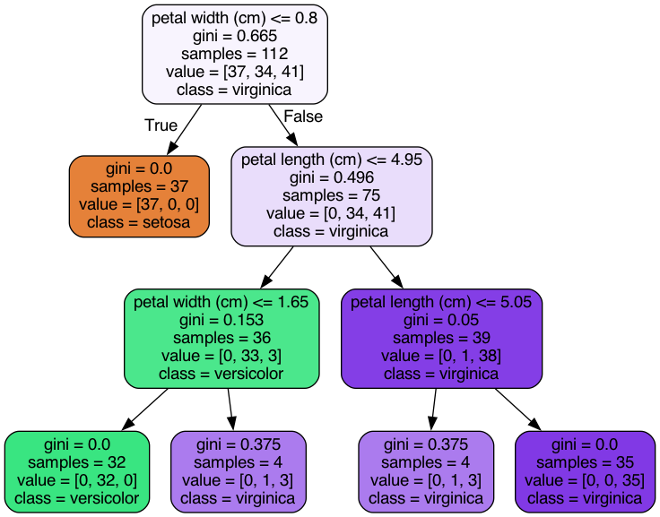

# Week 8 Exercises

On this week we learned how to use decision trees and random forests in data science.

Here is theory:
https://towardsai.net/p/programming/decision-trees-explained-with-a-practical-example-fe47872d3b53

Here is basically the first exercise explained:
https://towardsdatascience.com/visualizing-decision-trees-with-python-scikit-learn-graphviz-matplotlib-1c50b4aa68dc

